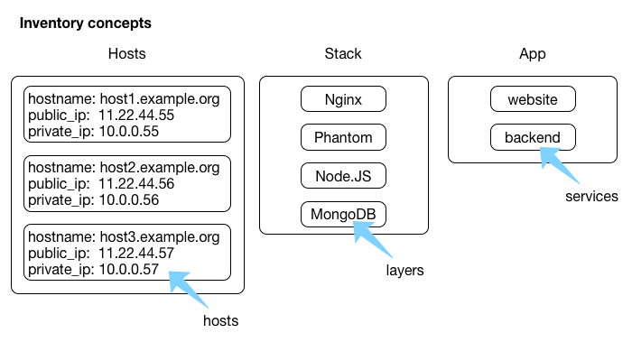

# Leitwarte Concepts

Within the Leitwarte control room you define an inventory that consists of three different kinds of entities:

- hosts
- layers
- apps

## Inventory

The inventory forms the basis for deployments and must be populated before deployments can take place.

### hosts

Hosts are physical or virtual machines that hold stack layers.

#### host attributes

Each host has the following attributes that can be edited:

- hostname
- IP
   - public
   - private (optional)
-  user credentials
   - user name
   - password *OR*
   - SSH key
- description (optional free text)

The following attributes cannot be edited:

- status (online/offline)
- last seen (timestamp)

### layers

Layers provide runtime containers such as a webserver (e.g. nginx), JavaScript runtime environment (e.g. Node.JS), or a database (e.g. MongoDB). Each layer must be assigned to one or more hosts. A host may contain all or only a subset of all layers required to run an app.

#### layer attributes

Each layer has the following attributes that can be edited:

- name
- description
- list of required software
- ansible script for setting up layer (hidden behind pretty UI?)

### apps

Apps implement the actual business logic and require an underlying infrastructure, a layer that is assigned to a host.
A Meteor application requires at least a `MongoDB` and `NodeJS` layer in order to be deployed successfully to a host.

#### app attributes

Each app has the following attributes that can be edited:

- name
- description
- sources link (git repo?)
- required layers
- associated hosts

## Deployment

Deployment should be carried out by external modules such as

- [Ansible](http://ansible.com)
- [mup/mupx](https://github.com/arunoda/meteor-up)
- Bash
- ...

## Monitoring

Monitoring of current status should include:

- availability of hosts (up/down)
- availability of apps on hosts (portscan/cluster_discovery db for meteor cluster)
- support for statsd/nagios modules